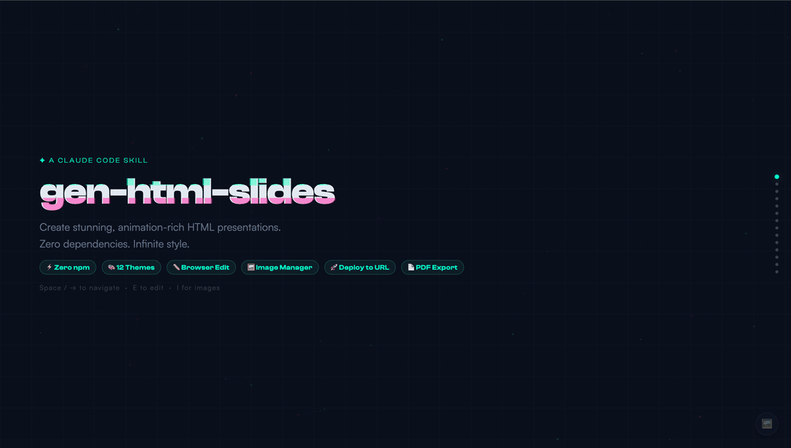
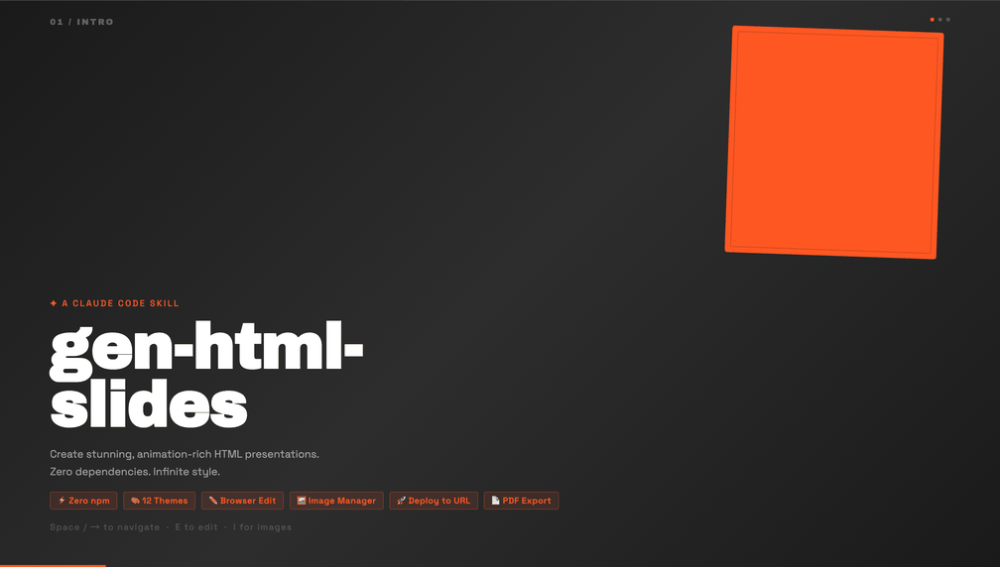
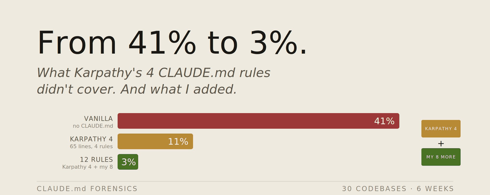

# cowork-skills

> [English](README.md)

基于工作需要 & 实践，验证过的好用 Claude Code skill 合集。

## Installation

所有 skill 共享同一个插件市场入口，一次添加，按需安装：

```
/plugin marketplace add Adamatoma/cowork-skills
```

---

## Skills

### [gen-html-slides](./skills/gen-html-slides/README.md)

从零创建或将 PowerPoint 转换为动效丰富的 HTML 演示文稿。无需设计能力，通过可视化预览选风格，生成零依赖的单 HTML 文件。





**核心能力：**
- 零依赖 — 纯 HTML/CSS/JS，无需 npm 或构建工具
- 视觉风格探索 — 生成 3 个预览让你直接选，而非描述偏好
- PPT 转换 — 保留图片、文字、备注，一键转 Web
- 12 套精选主题 — 深色/浅色/特色，拒绝 AI 通用感

```
/plugin install gen-html-slides@cowork-skills
```

---

### [coding-basic-rules](./skills/coding-basic-rules/README.md)

12 条工程纪律规则，约束 Claude Code 在编码任务中的行为默认值。改编自经过实践验证的 LLM 编程规范。



**核心能力：**
- 编码前思考，显式说明假设，不默默猜测
- 简洁优先，最少代码解决问题，不做投机性设计
- 精准修改，只动必须动的，不顺手"改进"无关代码
- 目标驱动执行，定义可验证的成功标准
- 大声失败，不隐藏不确定性，不虚报完成

```
/plugin install coding-basic-rules@cowork-skills
```

---

## 致谢

灵感来自「Vibe Coding」理念 —— 无需成为传统软件工程师，也能构建出美好的东西。

> 关注我的 X 账号：[@YutongPan3495](https://x.com/YutongPan3495)

## 许可证

MIT — 随意使用、修改、分享。
